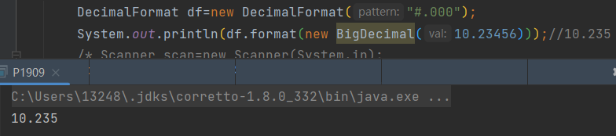

# Math取整
向上取整用Math.ceil(double a)；
向下取整用Math.floor(double a)；
四舍五入用Math.round(double num)；
对精度要求比较高，精度可能出现问题，
# DecimalFormat对象
首先构建一个DecimalFormat对象
DecimalFormat df=new DecimalFormat("#.000");
System.out.println(df.format(new BigDecimal(10.23456)));//10.235
注：使用"#.000"作为保留位数，DecimalFormat默认采用了RoundingMode.HALF_EVEN这种类型,而且format之后的结果是一个字符串类型String。

# String.format
double x=11.2345;
String r= String.format("%.3f",x);
System.out.println(r);//11.235,四舍五入
String.format可以格式化很多类型，包括整数、浮点数、字符串、日期等。此处是四舍五入进行转化。输出为字符串形式。