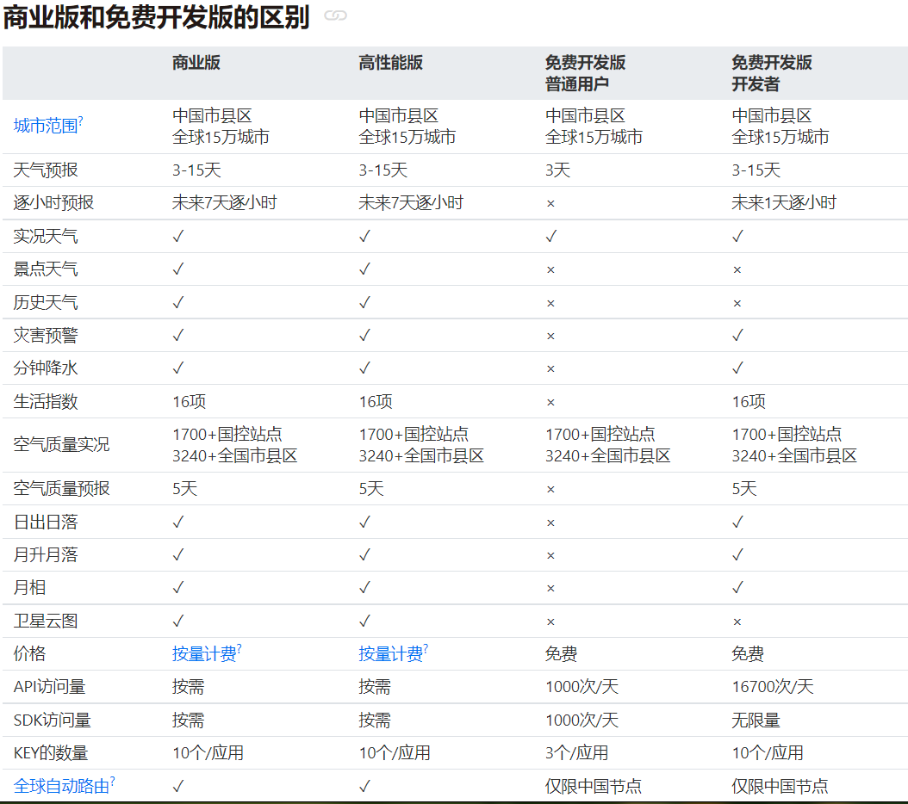

# 材料准备与环境搭建
## 所用材料
 1. ESP8266-NodeMCU 12e
 2. 1.3寸TFT全视角彩色显示屏 ,SPI,240X240驱动为ST7789,具体资料可见链接http://www.lcdwiki.com/zh/1.3inch_IPS_Module （商家给的）
 3. 免费的天气api接口，
     (1). 心知天气(https://www.seniverse.com/products?iid=new)。缺点：免费版数据只能精确到县城,获取到的数据只有3项。优点：网上教程较多，资料找起来比较方便
        
       (2). 和风天气api(https://dev.qweather.com)  
	   优点：免费版和付费版能获取的一样多，比心知良心一点，开发插件等其他用途也比较方便。
	   缺点：因为返回数据是gzip压缩的，8266常用的获取方法容易乱码，截止目前，我仍没成功获取到数据。
	   