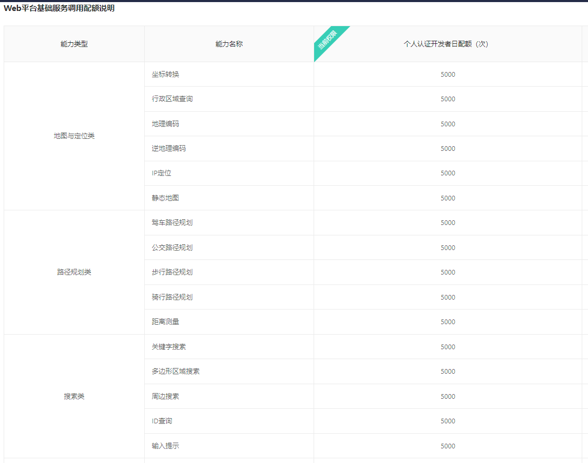
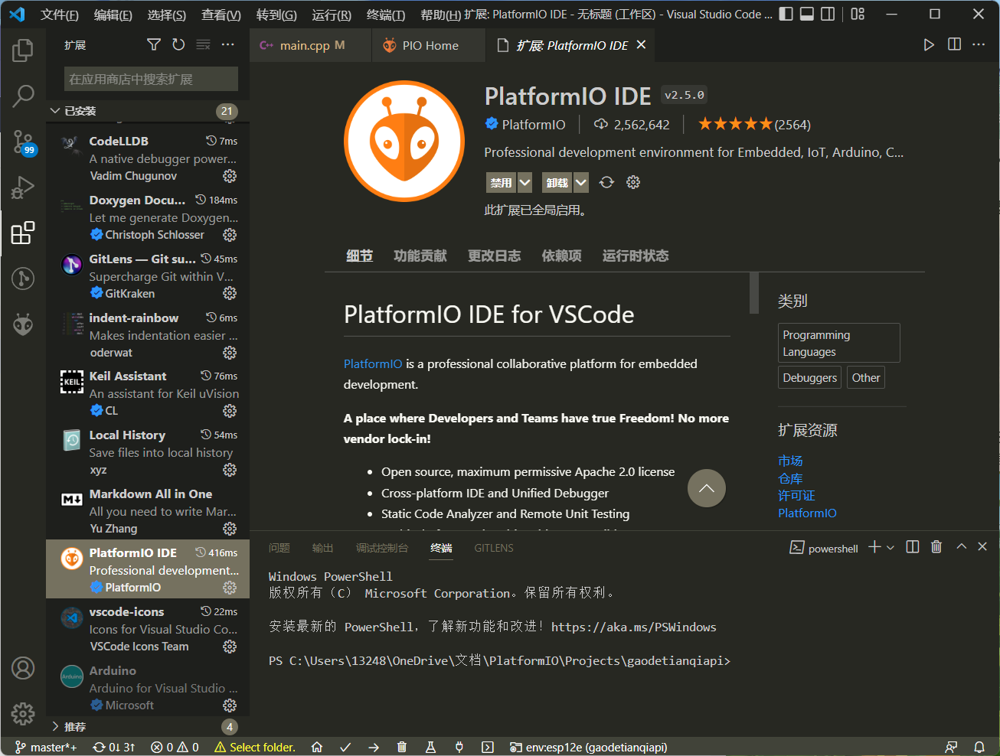

# 材料准备与环境搭建
## 所用材料
 1. ESP8266-NodeMCU 12e
 2. 1.3寸TFT全视角彩色显示屏 ,SPI,240X240驱动为ST7789,具体资料可见链接http://www.lcdwiki.com/zh/1.3inch_IPS_Module （商家给的）
 3. 免费的天气api接口，
     (1). 心知天气(https://www.seniverse.com/products?iid=new)。
	 优点：网上教程较多，资料找起来比较方便。
	 缺点：免费版数据只能精确到县城,获取到的数据只有3项。
        
       (2). 和风天气api(https://dev.qweather.com)  
	   优点：免费版和付费版能获取的一样多，比心知良心一点，开发插件等其他用途也比较方便。
	   缺点：因为返回数据是gzip压缩的，8266常用的获取方法容易乱码，截止目前，我仍没成功获取到数据。<i class="fas fa-poo"></i>
	   
	   (3). 高德天气api(https://console.amap.com)  
	   优点：不仅仅是天气api包含其他更多信息，天气api不限量访问，获取数据也比较简单，数据类型比较丰富。
	   缺点：目前没感觉到很大的缺点，也是我目前正在使用的一个api。
	   

## 环境搭建
  1.Arduino下载与安装，ESP8266包的安装。百度教程非常丰富，但是我感觉的编辑器太难用了，没有语法提示。我还需要学习stm32的开发，我选择使用的是VScode结合PlatformIO进行开发，需要什么开发什么下载什么包，在VScode安装PlatformIO即可。需要注意安装时，要挂VPN访问gitgub(推荐使用steam++)。  

#  正式开发
## 连接wifi
		
## 查看天气api的开发文档，确定其返回的JSON数据，用于解析，